# Itsehaj - portfolio

## Link to Application
Click on link to see the deployed website [https://sehaj97.github.io/ItSehaj/](https://sehaj97.github.io/ItSehaj/)

## Description
This is my protfolio.

I constructed it using html and scss. As scss runs on server so I ran 'sass --watch styles.scss:styles.css' in git bash to convert the scss file to css and attach it to html.

The website is responsive as well.

### Clone the repository
git clone git@github.com:sehaj97/My-Awesome-Portfolio.git

_or_

git clone https://github.com/sehaj97/My-Awesome-Portfolio.git

## Screenshots
### Desktop
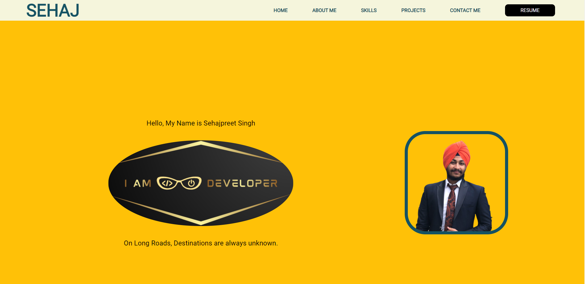
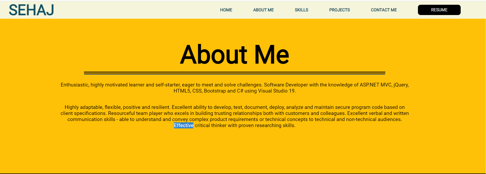
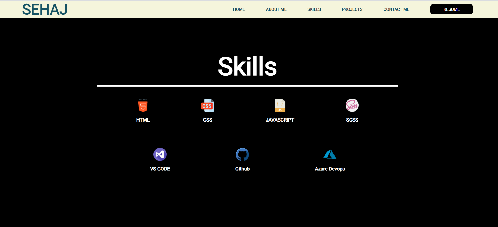
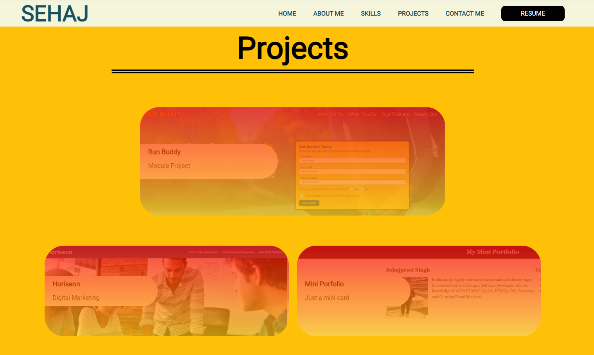
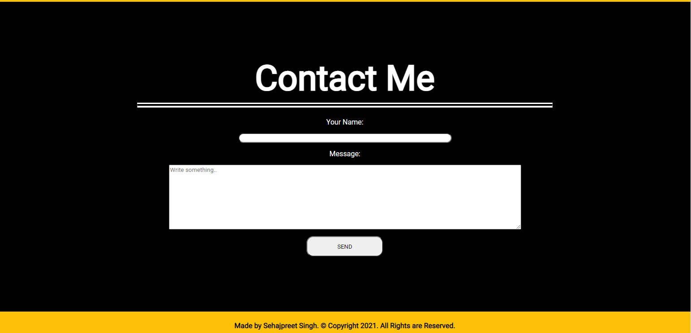
### Tablet
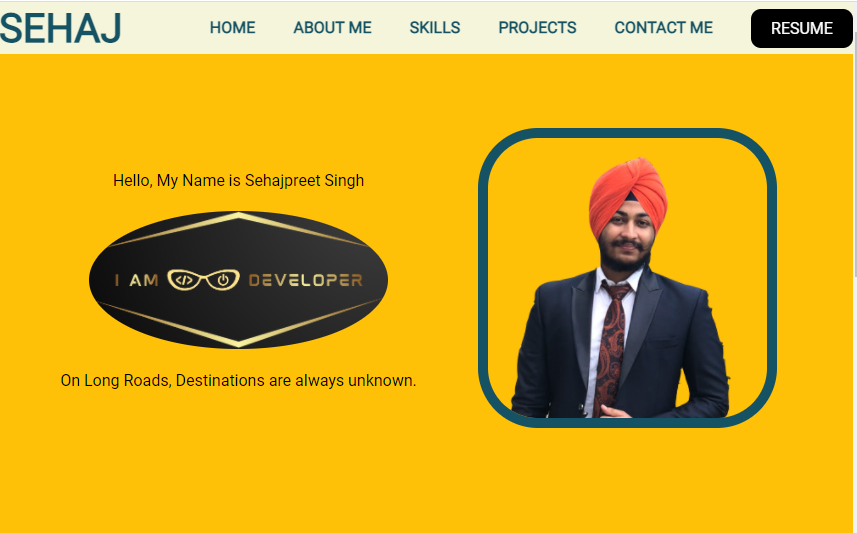
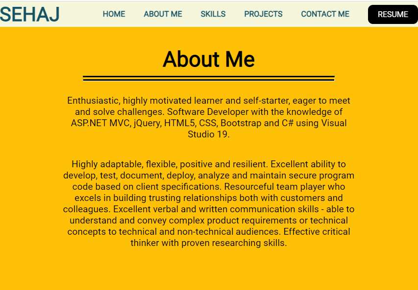
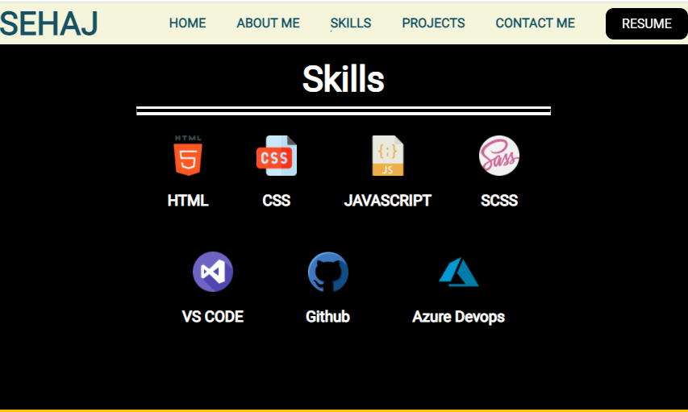
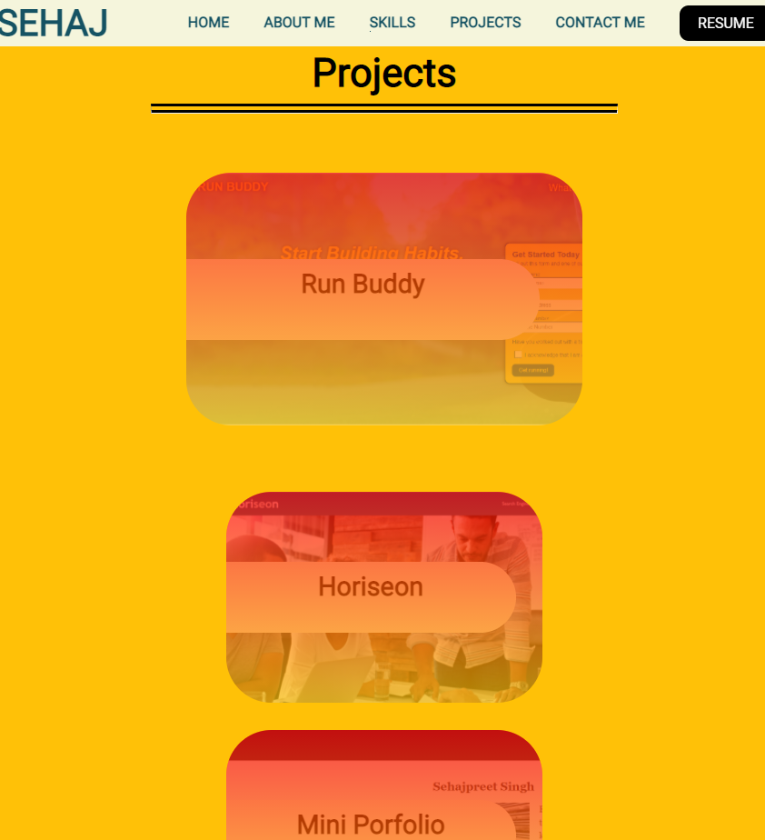
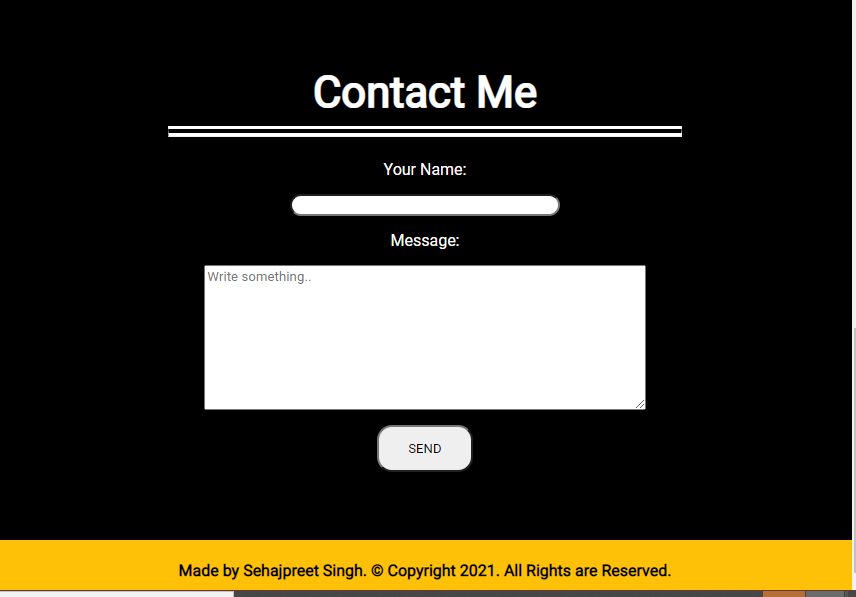
### Mobile
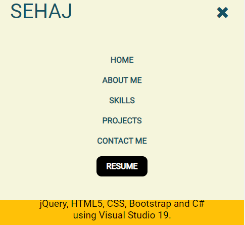

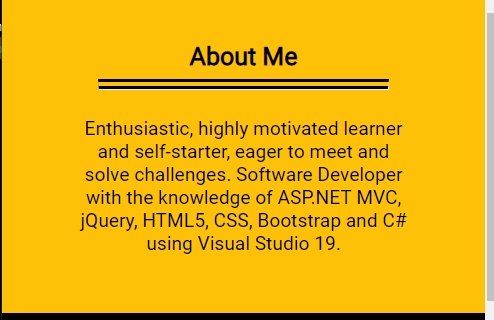
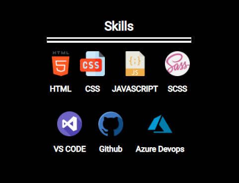
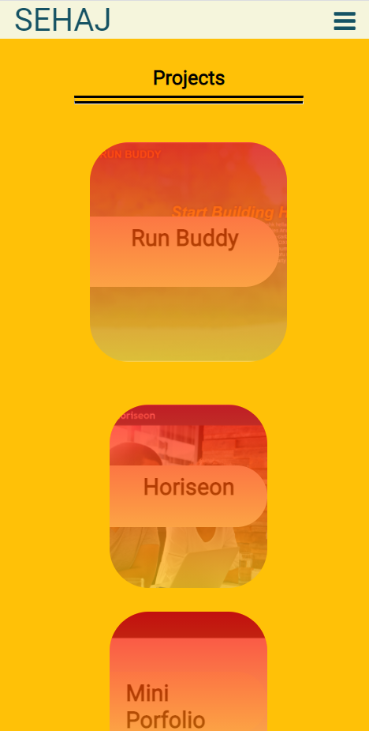
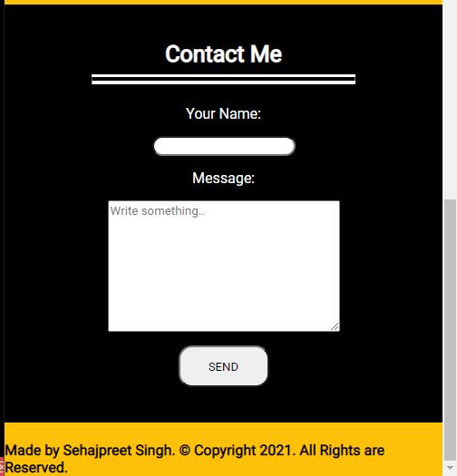
### Deployed Portfolio
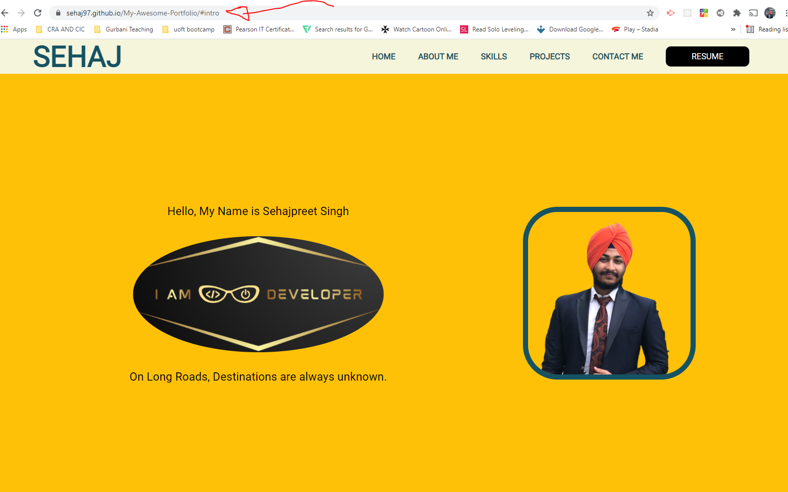

